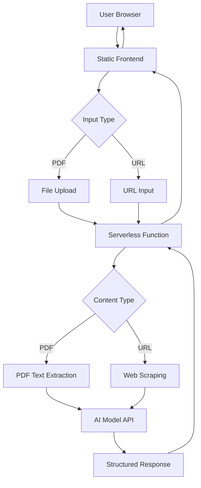

# Grant Analyzer MVP Design Document

## Overview

The Grant Analyzer is a serverless web application that processes grant guidelines from either PDF files or web URLs and extracts key information using AI. The system consists of a simple frontend for file upload/URL input and result display, and a serverless backend that handles PDF processing, web scraping, and AI integration.

## Architecture



### Technology Stack

**Frontend:**
- HTML5 for structure
- Tailwind CSS for styling and responsive design
- Vanilla JavaScript for interactivity and API calls
- Static hosting (can be deployed to Netlify, Vercel, or similar)

**Backend:**
- Google Cloud Functions (or Firebase Functions) for serverless processing
- PDF parsing library (pdf-parse for Node.js)
- Web scraping library (cheerio + axios for Node.js)
- Google Gemini API for AI text analysis
- CORS enabled for frontend communication

## Components and Interfaces

### Frontend Components

#### 1. Input Component
- **Purpose:** Handle both PDF file upload and URL input
- **Features:**
  - Toggle between PDF upload and URL input modes
  - Drag-and-drop interface for PDF files
  - File type validation (PDF only)
  - File size validation (max 10MB)
  - URL format validation
  - Upload/processing progress indicator
  - Error message display for both input types

#### 2. Results Display Component
- **Purpose:** Show structured grant information
- **Sections:**
  - Eligibility Checklist (bulleted list)
  - Key Deadlines (formatted dates)
  - Funding Details (min/max amounts)
  - Required Documents (checklist format)
- **Features:**
  - Loading states
  - Error handling
  - Responsive layout

#### 3. Loading Component
- **Purpose:** Provide user feedback during processing
- **Features:**
  - Progress spinner
  - Status messages
  - Timeout handling (30-second limit)

### Backend Components

#### 1. Content Processing Service
```javascript
// Interface
{
  extractTextFromPDF: (pdfBuffer) => Promise<string>
  extractTextFromURL: (url) => Promise<string>
  validatePDF: (file) => boolean
  validateURL: (url) => boolean
}
```

#### 2. AI Analysis Service
```javascript
// Interface
{
  analyzeGrant: (text) => Promise<GrantSummary>
}

// GrantSummary Type
{
  eligibility: string[]
  deadlines: string[]
  funding: {
    minimum?: string
    maximum?: string
    details: string[]
  }
  requiredDocuments: string[]
}
```

#### 3. Main Handler Function
```javascript
// Cloud Function Entry Point
exports.analyzeGrant = async (req, res) => {
  // Handle CORS
  // Validate request
  // Process PDF
  // Call AI service
  // Return structured response
}
```

## Data Models

### Request Model
```javascript
{
  inputType: 'pdf' | 'url',
  file?: File, // PDF file from frontend (when inputType is 'pdf')
  url?: string, // Web URL (when inputType is 'url')
  metadata?: {
    filename?: string,
    size?: number,
    url?: string
  }
}
```

### Response Model
```javascript
{
  success: boolean,
  data?: {
    eligibility: string[],
    deadlines: string[],
    funding: {
      minimum?: string,
      maximum?: string,
      details: string[]
    },
    requiredDocuments: string[]
  },
  error?: {
    message: string,
    code: string
  }
}
```

### AI Prompt Template
```
You are an expert grant application analyst. I will provide you with the full text from a grant guideline document. Your task is to analyze this text and extract ONLY the following information. Present it in a clear, structured JSON format. Do not add any information that is not present in the text I provide.

Extract the following sections:
1. Eligibility Criteria: Who can apply (as bullet points)
2. Key Dates & Deadlines: Important dates including application deadline
3. Funding Amount: Minimum and maximum funding available
4. Required Attachments: List of documents needed for application

Format your response as JSON:
{
  "eligibility": ["criterion 1", "criterion 2"],
  "deadlines": ["deadline 1", "deadline 2"],
  "funding": {
    "minimum": "amount or null",
    "maximum": "amount or null", 
    "details": ["funding detail 1"]
  },
  "requiredDocuments": ["document 1", "document 2"]
}

If any section cannot be found, use an empty array or null values.

Document text: {PDF_TEXT}
```

## Error Handling

### Frontend Error Scenarios
1. **Invalid file type:** Display "Please upload a PDF file"
2. **File too large:** Display "File size must be under 10MB"
3. **Invalid URL format:** Display "Please enter a valid web URL"
4. **Both inputs provided:** Display "Please choose either PDF upload or URL input"
5. **Network error:** Display "Connection failed. Please try again"
6. **Processing timeout:** Display "Processing is taking longer than expected. Please try again"

### Backend Error Scenarios
1. **PDF parsing failure:** Return structured error with retry suggestion
2. **URL fetch failure:** Return error indicating the webpage is inaccessible
3. **Web scraping failure:** Return error indicating content extraction issues
4. **AI API failure:** Return error with fallback message
5. **Invalid request:** Return validation error details
6. **Rate limiting:** Return appropriate retry-after message

### Error Response Format
```javascript
{
  success: false,
  error: {
    code: "PROCESSING_ERROR",
    message: "Unable to process PDF. Please ensure it contains readable text.",
    retryable: true
  }
}
```

## Testing Strategy

### Frontend Testing
1. **Unit Tests:**
   - File validation functions
   - Response parsing logic
   - Error handling functions

2. **Integration Tests:**
   - File upload flow
   - API communication
   - Result display rendering

3. **Manual Testing:**
   - Cross-browser compatibility
   - Mobile responsiveness
   - File upload edge cases

### Backend Testing
1. **Unit Tests:**
   - PDF text extraction
   - AI prompt formatting
   - Response validation

2. **Integration Tests:**
   - End-to-end PDF processing
   - AI API integration
   - Error handling flows

3. **Load Testing:**
   - Concurrent file processing
   - Large file handling
   - API rate limiting

### Test Data Requirements
- Sample PDF files with various grant formats
- PDFs with missing information sections
- Corrupted or invalid PDF files
- Large PDF files (near 10MB limit)

## Security Considerations

1. **File Upload Security:**
   - Validate file type on both frontend and backend
   - Scan for malicious content
   - Limit file size to prevent DoS

2. **API Security:**
   - Implement CORS properly
   - Rate limiting on serverless function
   - Input sanitization for AI prompts

3. **Data Privacy:**
   - No persistent storage of uploaded files
   - Clear temporary files after processing
   - No logging of sensitive document content

## Performance Optimization

1. **Frontend:**
   - Lazy loading of components
   - Optimized bundle size with Tailwind purging
   - Efficient file reading with FileReader API

2. **Backend:**
   - Efficient PDF parsing with streaming
   - Optimized AI prompts for faster response
   - Proper memory management for large files

3. **Caching Strategy:**
   - Static assets cached at CDN level
   - No caching of dynamic content due to privacy concerns